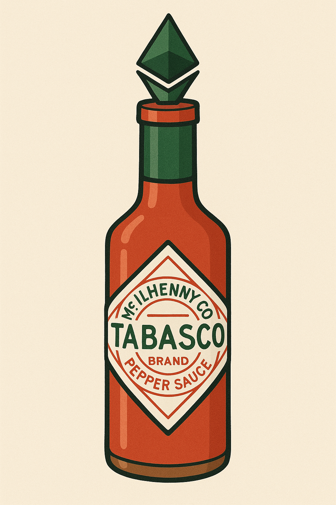
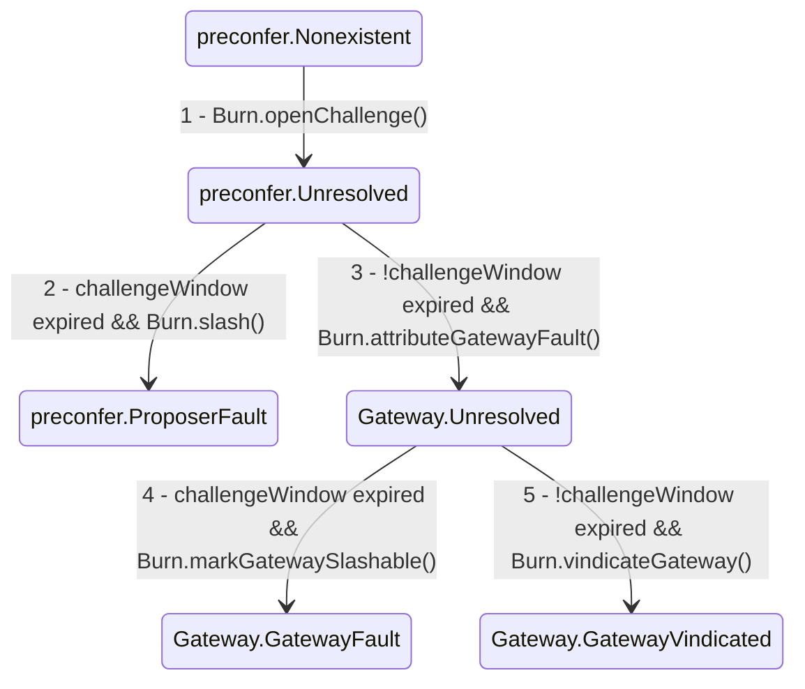
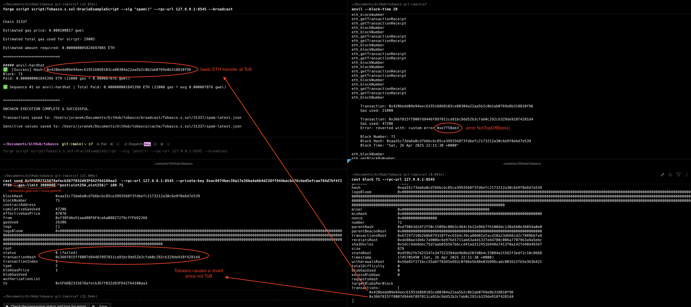

# Tobasco
Tobasco is a proof-of-concept implementation of a preconf protocol that enforces ToB L1 inclusions. 



## How to enforce Top of Block (ToB) inclusions during execution?
[Brecht](https://x.com/Brechtpd) came up with a [cool trick](https://x.com/Brechtpd/status/1854192593804177410):

> A trick to check in a contract if you're in the 1st tx of a block
>
> Set the tx gas limit to the block gas limit, check:
>
> block.gaslimit - gasleft() - intrinsic_gas_cost < 21000

The `Tobasco.onlyTopOfBlock()` modifier enforces this check for arbitrary function calls.

When combined with proposer commitments, this creates a very powerful primitive that enforces:
1. Your tx is included at ToB or else the proposer will be slashed
2. If your tx is included anywhere but ToB, it will revert and the proposer will be slashed

## How to penalize a broken commitment?
> Readers are expected an understanding about the [URC](https://github.com/eth-fabric/urc) and [fault attribution](https://github.com/eth-fabric/constraints-specs/blob/main/specs/fault-attribution.md) within the context of the Constraints API

### Contracts
- **`Tobasco.sol`**: Contains the minimal logic to enforce ToB inclusion during execution through the `onlyTopOfBlock()` modifier. Upon successful execution, the modifier will call `_recordSubmission()` which saves a boolean that indicates a ToB transaction was executed during that block. This value is used to help `Burn.sol` determine if a commitment was broken.
- **`Burn.sol`**: Contains the slasher logic to slash URC-registered proposers who break ToB commitments.
- **lib/***: Contains helper contracts copied from the [Bolt repo](https://github.com/chainbound/bolt/) 

### Issuing a Commitment
We assume a `Preconfer` has signed a [`Commitment`](https://github.com/eth-fabric/urc/blob/5f18225c4d027b49084605129b7666a37ea13412/src/ISlasher.sol#L30) message that includes a `ToBCommitment` struct in its `payload`:
```solidity
    struct ToBCommitment {
        // The block number the transaction should have been submitted
        uint48 blockNumber;

        // The address of the ToB contract
        address tobasco;

        // The target function selector committed to being called
        bytes4 funcSelector;
    }
```

### Faults
Assuming the `Preconfer` issued a `ToBCommitment`, there are some ways things can go wrong:

1. They tried to include the transaction in a different position in the block, aka the Rest of Block (RoB).

    - **fault**: If the transaction executes, it could result in a different state than expected.

    - **mitigation**: `onlyTopOfBlock()` modifier reverts if the transaction is not ToB, preventing this type of safety fault

    - **slashing**: Given a signed `ToBCommitment`, `Burn.sol` can query if a ToB transaction executed at a given block number via `Tobasco.submitted()`.
    
2. They proposed a block with a *different* transaction at ToB.

    - **fault**: They are effectively censored.

    - **mitigation**: The `Preconfer` is incentivized to follow through on their commitment to avoid slashing.
    
    - **slashing**: Same as 1.

3. They missed their slot.

    - **fault**: They are effectively censored.

    - **mitigation**: The `Preconfer` is incentivized to follow through on their commitment to avoid slashing.
    
    - **slashing**: Same as 1.

### Slashing
The previous section describes the result of failing a ToB commitment, but implementation-wise there is some nuance. `Burn.sol` assumes the `Preconfer` delegates to a `Gateway` and they follow the [fault-attribution](https://github.com/eth-fabric/constraints-specs/blob/main/specs/fault-attribution.md) guide.

Specifically we assume:
- A `Preconfer` will only propose an L1 block if they've first verified a signed `blockhash` from their delegated `Gateway`.
- `Gateways` can be slashed but this is out of scope, so they are just marked as slashable by `Burn.gatewaySlashable(faultID)`.
- `Burn.sol` needs to prevent honest `Preconfers` or `Gateways` from being slashed due to a ToB transaction reverting due to user error.

If a user wants to slash `Preconfer` because their ToB transaction was not included (`Tobasco.submitted(blockNumber) == false`), then `Burn.sol`'s slashing logic can be understood via the following state transition diagram:

1. By calling `Burn.openChallenge()`, a user is proving that their transaction did not execute at ToB during the committed block number. At this point, it is clear there was a violation but it is unclear if the `Preconfer` or `Gateway` is at fault.
2. If the `challengeWindow` expires without a `Preconfer` rebutting, then they are assumed to be at fault and can be slashed via `Burn.slash()` which must be initiated by `URC.slashCommitment()`.
3. Anyone can call `Burn.attributeGatewayFault()` before the challenge window expires by supplying a Gateway-signed blockhash. When the `Gateway` signs off on the block, they are attesting that is satisfies all commitments. So if presented with this signature as evidence, `Burn.sol` will vindicate the `Preconfer` and pass the blame to the `Gateway`. However, here is still some ambigutity: the ToB execution could have reverted due to user error (i.e., out-of-funds) so another `challengeWindow` is started for the `Gateway` to clear their name.
4. If the `challengeWindow` expires without a `Gateway` rebutting, then they are assumed to be at fault and their status is updated to `GatewayFault` by calling `Burn.markGatewaySlashable()`. They can be slashed via an external slasher contract which can query their status via `Burn.gatewaySlashable(faultID)`.
5. If `Burn.vindicateGateway()` is called before challenge window expires and supplied with a valid Merkle inclusion proof, then the `Gateway's` status changes to `GatewayVindicated` and external `Gateway` slashers should not slash them. The Merkle inclusion proof is used to prove the transaction attempted to execute at ToB despite it not saving to the `_submitted` mapping due to reversion.


### Testing


The image demos Tobasco in action:
- An `OracleExample` contract has been deployed and implements the `onlySubmitter` and `onlyTopOfBlock` modifiers so that it's `post()` function only succeeds if it lands ToB.
- On the top right, a local anvil node publishes blocks every 20s
- On the top left, an ETH transfer lands at the ToB
- On the bottom left, the call to `post()` reverts with a `NotTopOfBlock` error
- On the bottom right, we inspect the block and see that the `post()` transaction did land second.

Note if recreating this test, modifying the transaction gas limit in a Foundry script isn't working. The following command will work once the `ADDRESS` and `BLOCKNUM` environment variables are set:

```bash
cast send $ADDRESS  --rpc-url 127.0.0.1:8545 --private-key 0xac0974bec39a17e36ba4a6b4d238ff944bacb478cbed5efcae784d7bf4f2ff80 --gas-limit 30000000 "post(uint256,uint256)" 100 $BLOCKNUM
```